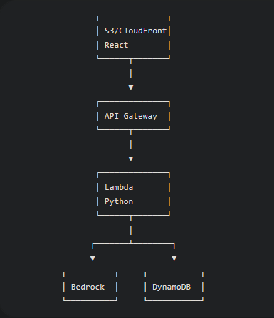
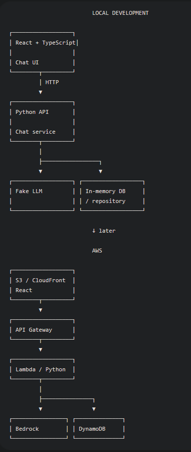

# Device Erasure Chatbot

**Joni Voutilainen**

## Overview

### The plan

I started this challenge by prompting ChatGPT with the assignment and asked how and with what tools should I start creating the chatbot. ChatGPT came up with the following architecture:

After going through AI's reasoning and familiarizing myself a bit more about these chosen tools, I decided to go with the plan.

While researching the tools depicted in the architecture plan above, I realized there's probably going to be some kind of cost associated with using them. After researching the topic in question, I learned that some of the tools, for example Amazon Bedrock, which provides LLM's for developers to use in their applications, uses a pricing model based on tokens consumed. So everytime your application uses the LLM, a token is used. So for the purpose of this project, I didn't want to incur any costs for myself, so I decided to first build the application locally without any AWS services. This way I could test and tinker with it freely without worrying about any costs associated with AWS services. After prompting chatgpt with this idea in mind, it came up with a solution as shown below:

So the plan was to first develop a solution that works fully locally, but design and implement it in a way that it's easy to plug in AWS services into it with minimal changes to the code. In the end I didn't manage to complete the plan as I visioned it in the beginning, as the hours I put in started to exceed what I felt comfortable with for a job recruitment assignment. The size and complicatedness of the project also started to creep up on me and I felt my expertise was not quite enough to handle everything by myself. So after a week of working hard on the assignment, I felt like this is the most I can learn and come up with in the given time constraints. So here's what I came up with.

### Project structure

- device-erasure-chatbot >
  - backend >
    - aitools > | Contains the functionality of how the LLM interacts with the tools
      - definitions.py | Contains Bedrock compatible definitions for the tools and for what they are used
      - executor.py | Handles dispatching of the tool asked by LLM
      - implementations.py | Contains the tools to get data from database and return it in a structured way
    - database >
      - base.py | Interface for database operations
      - local.py | Functionality for local database operations
    - api.py | FastAPI api for endpoints to test the application locally
    - data_loader.py | Used to load data from json file and convert them into a usable form
    - models.py | Dataclass to define a single erasure record object
    - requirements.txt | dependencies
  - data >
    - example_records.json | A json file containing example erasure records data created by generate_data.py script
  - documentation | materials for the final assignment report
  - erasure-chat-frontend > | React frontend with Vite
    - src >
      - api >
        - chat.ts | Contains the functionality for the chat response
      - App.css | Styling the chat interface
      - App.tsx | Contains the chat interface and it's functionality
      - index.css | Styling the chat interface
  - scripts >
    - generate_data.py | Script to generate a json file with example erasure records data
  - tests >
    - test_executor.py | Test for testing the executor.py
    - test_get_erasure.py | Test for testing getting a erasure record by its serial number from the database

So in its current form, I got the project to a point where there is a working frontend hosted locally. The user can get details of a given erasure record (fetched from the example_records.json) by typing the serial number of the record in to the chat box. In the finished product, this data would have been fed to the LLM, and it would've come up with a coherent answer. The project in its current state is far from the finished product, but I feel like there's still something concrete to look at and test. Given I had no preliminary knowledge regarding the concepts and technologies in the assignment, expect for React, I am really proud of what I managed to accomplish.

## How to run

TESTIT EI TOIMI KOSKA EPÄTAVALLISUUKSIA IMPORT POLUISSA

frontend: npm run dev

testit: pytest

backend server: ../backend python -m uvicorn api:app --reload

generate_data.py

## Decisions

At this point I feel like the choice to go fully local at first was bit of a mistake considering the time constraints.

## AI usage
